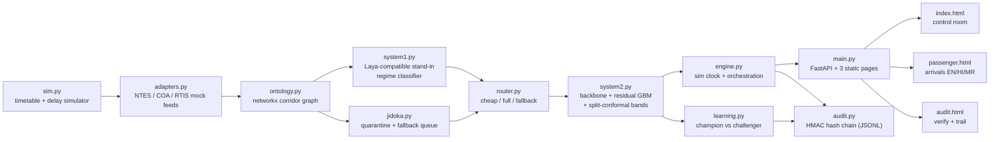

# Dynamic ETA Forecast — Prototype (SIH26028)

> **ALL DATA SIMULATED.** Every screen, API response (`"simulated": true`), and
> audit entry in this repo is generated by a simulator. Nothing here reflects
> real trains, real delays, or real-world accuracy.

Live arrival-time forecasts with uncertainty bands (P10–P50–P90), a human-in-the-loop
Jidoka queue, a tamper-evident audit trail, and a learning loop — on one corridor
of 12 stations, 40 simulated trains.

## Install and run (3 commands)

```bash
python3.11 -m venv .venv && .venv/bin/pip install -e .
.venv/bin/python -m uvicorn app.main:app --port 8000
xdg-open http://localhost:8000   # or open in a browser manually
```

Alternatives: `uv sync && uv run uvicorn app.main:app` works too
(`uv.lock` is committed). Tests: `.venv/bin/python -m pytest tests/ -q`
(37 tests; needs `pip install pytest httpx` if you skipped dev deps).

For a clean demo from any state: stop the server,
`rm -f data/audit.jsonl data/learning_state.json`, restart — the clock resets
to 10:00 and the audit chain is recreated. (Do **not** click “Run learning
cycle” idly: each click consumes one step of the PROMOTED→REJECTED demo
sequence; reset with `rm -f data/learning_state.json data/residual.pkl`.)

## Architecture



(No `solution_description.md` exists in this repo, so the diagram above is drawn
from the implemented modules, not reused. Request flow per train: System 1
regime probabilities → router picks a path → System 2 forecasts; Jidoka can
force schedule-fallback for stale or quarantined feeds.)

## What is real vs stand-in

| Piece | Status in this build |
|---|---|
| Delay simulator, 12-station corridor, 40 trains | Real code, **simulated data** |
| System 1 “Laya” | **Stand-in**: sklearn classifier + temperature scaling behind a Laya-shaped `ask(state, question, options)` interface, labelled “Laya-compatible stand-in” (real Laya out of scope) |
| Ontology store | **In-memory** networkx graph (not a self-hosted graph DB) |
| GNN / conformal | Congestion feature + ~10-line split-conformal step |
| Audit signing | HMAC-SHA256 hash chain in `data/audit.jsonl` (demo key, never production) |
| UI | Static HTML + vanilla JS, UX4G design system via pinned CDN `https://cdn.ux4g.gov.in/UX4G@3.2.0/`, Railway navy `#1B3A6B` / saffron `#E87722` root token overrides, `data-theme` light/dark toggle, “Simulated data” badge on every page |

## 4-minute click-through

1. **Dashboard + matrix (30 s).** Open `/`. Header KPIs (40 trains, on-time %, fallback count, model version, Jidoka open), ETA ranges table, and the 12×40 delay-matrix heatmap all populate from the API.
2. **Advance + router paths + explanation (30 s).** Press **Advance 5 min** — ETAs visibly move. “Regime + router activity” shows full/fallback/cheap counts with regime chips; the “Explanation + what-if” panel narrates drivers (restriction, recovery slack) for the selected train. Try the **Hold 10 min** what-if button.
3. **Jidoka quarantine + approve (45 s).** Fresh boot opens with 6 pending items (`J1 · quarantine · T101` first) — one quarantine plus five genuinely stale feeds. Trains that have not departed yet are routed to the schedule but are not queue items, so the queue stays reviewable. Press **Approve** (or **Dismiss**) — the queue shrinks and dependent ETAs recompute.
4. **Learning: promote then reject (90 s).** Press **Run learning cycle** (~30 s, spinner shown) → `PROMOTED` (better challenger, cycle 1). Press again → `REJECTED` (degraded challenger fails the coverage gate, cycle 2). The model-version KPI advances to “champion · cycle N”.
5. **Audit verify (20 s).** Open `/audit.html`, press **Verify chain** → “Verified — chain intact”. (T13 verified the negative: editing one field of `data/audit.jsonl` makes verification report the first bad seq.)
6. **curl an API call (15 s).** `curl localhost:8000/api/eta/T101 | python3 -m json.tool | head -30` — per-station `p10/p50/p90`, `p_on_time`, regime, path, flags, drivers.
7. **Passenger view (30 s).** Open `/passenger.html`, pick a train, read “expected 14:32 (14:28–14:41)”-style rows with on-time chances, toggle **HI**/**MR** — all 13 labels switch languages.

API reference with try-it-out is auto-generated at `/docs`.

## Demo recording

[`DEMO-GUIDE.md`](DEMO-GUIDE.md) — 60-second teleprompter script with click
cues, pre-flight reset steps, a troubleshooting table, and the answers to the
questions a judge is most likely to ask (including why the "Fallback count" KPI
reads 33).

## Limitations

Results are simulated and do not show real-world accuracy: the timetable,
delays, feeds, restrictions, and learning outcomes are all scripted demo
fixtures; the Laya stand-in, in-memory graph, and HMAC audit chain are
simplifications that would need replacing (real Laya, persistent graph store,
key management, multilingual reader, what-if UI, 10k-train scale, Kubernetes)
before any production claim. Do not quote MAE/coverage numbers outside this demo.
